# 🏥 Gestion des Consultations - JavaFX  

Une application JavaFX permettant de gérer les consultations et les patients de manière simple et efficace.  

## 📌 Objectif  
Développer une interface graphique pour **ajouter, modifier, supprimer et afficher** les patients et leurs consultations.  

## 🛠️ Fonctionnalités  

### 🏷️ Modèles de données  
- Création des classes **`Consultation`** et **`Patient`** avec :  
  - Des **attributs** pour stocker les informations essentielles.  
  - Des **constructeurs** et **getters/setters**.  
  - Une méthode **`toString()`** pour un affichage lisible.  

### 🎨 Interface utilisateur  
- Vue principale **`main-view.fxml`** intégrant un `TabPane` pour naviguer entre les sections.  
- Deux vues spécifiques :  
  - **`patients-view.fxml`** : Formulaire et liste des patients.  
  - **`consultations-view.fxml`** : Formulaire et liste des consultations.  

### 🎯 Contrôleurs  
- **`PatientController`** et **`ConsultationController`** pour gérer les **événements utilisateur** et l’interaction avec les données.  

### 🎨 Design et ergonomie  
- Intégration du **style BootstrapFX** pour une interface moderne et intuitive.
  
### 🚀 Exécution de l’application  
- Création d’une **classe principale** avec la méthode **`start()`** pour initialiser et lancer l’application.  

## 🎥 Captures d'écran


## Gestion des Patients  

| Ajout de patinet | Avant La recherche du patient | Aprés La recherche |
|---|---|---|
| 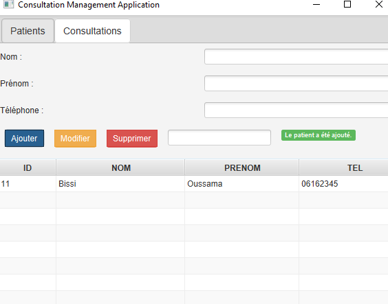 | 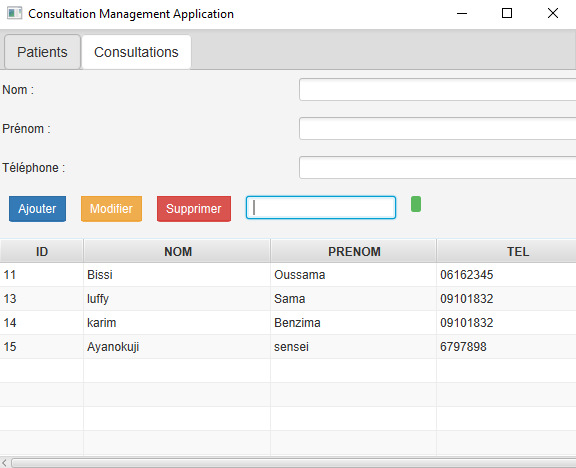 | 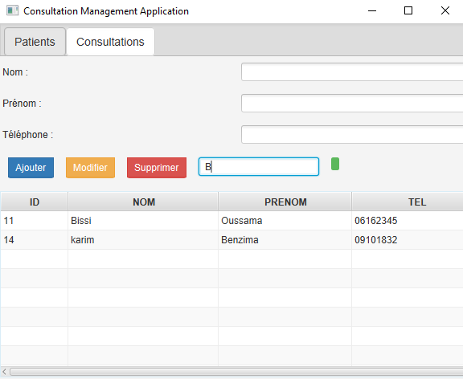 |

| Avant la Modification du patinet | Modification du patient | Selectionner un patient | Suppression du patient |
|---|---|---|---|
| 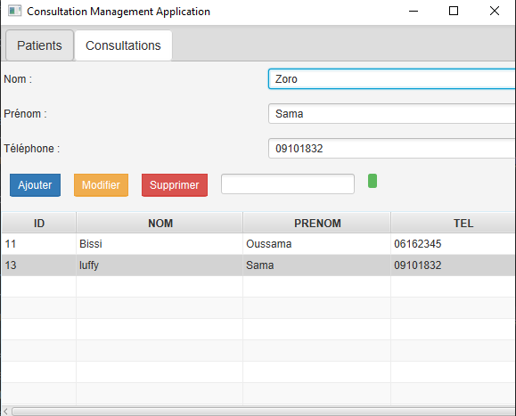 | 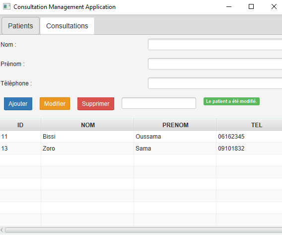 | 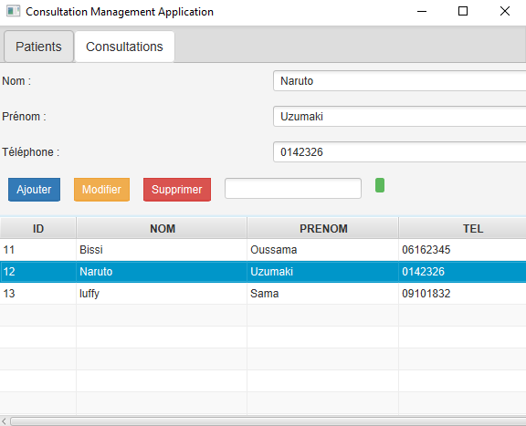 | 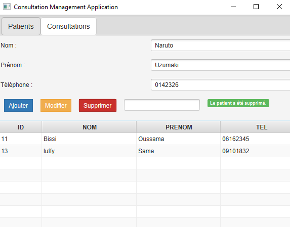 |

<hr>

## Gestion des Consultations  

| Avant l'Ajout Consultation | Aprés l'ajout d'une consultation | Recherche de produit |
|---|---|---|
| 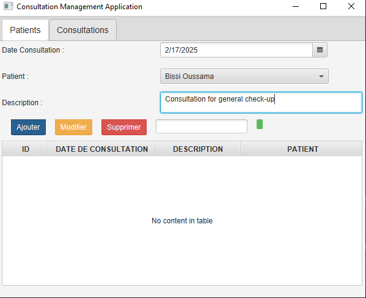 | 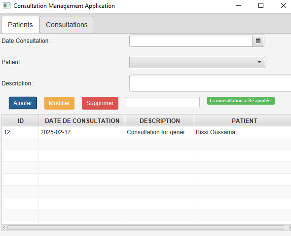 | 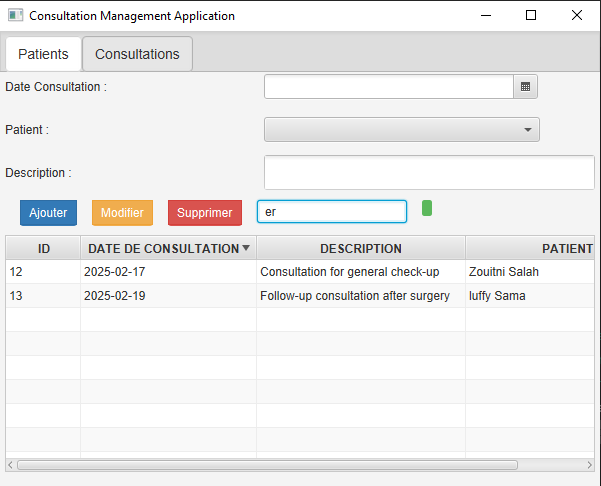 |

| Modification d'une consulltation | Selectionner une Consultation | Supprimer une Consultation |
|---|---|---|
|  | 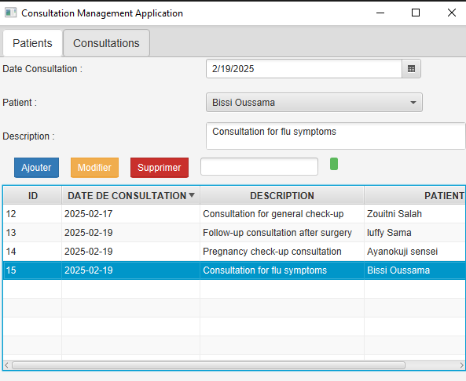 | 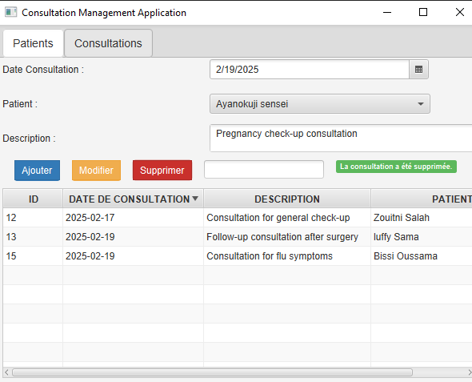 

 <hr>
 
## Gestion des Exceptions  

| Exception 1 | Exception 2 | Exception 3 |
|------------|------------|------------|
| 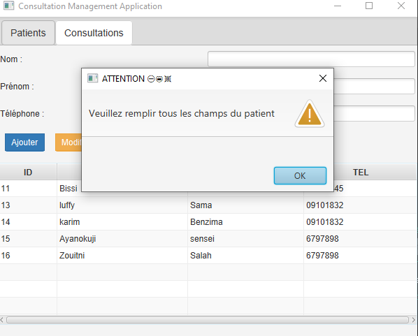 | 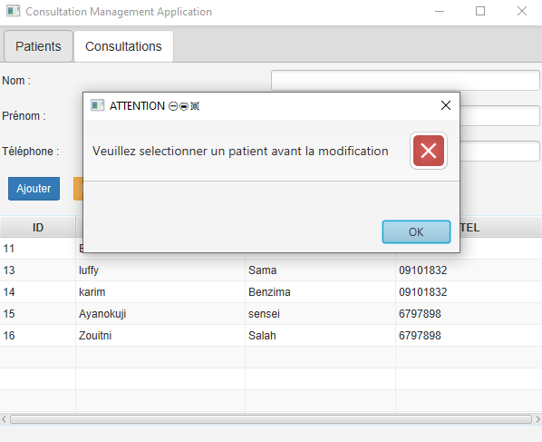 | 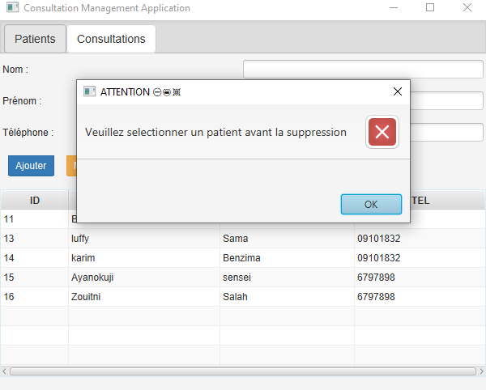 |


<hr>
   
## Comment Exécuter

1. Cloner le dépôt :
   ```bash
   git clone https://github.com/ouss-issib/practical-activity-java-fx.git

2. Naviguer dans le répertoire du dépôt :
   ```bash
   cd practical-activity-java-fx

3. Compiler et exécuter les fichiers Java :
   ```bash
    mvn clean install
    mvn javafx:run

